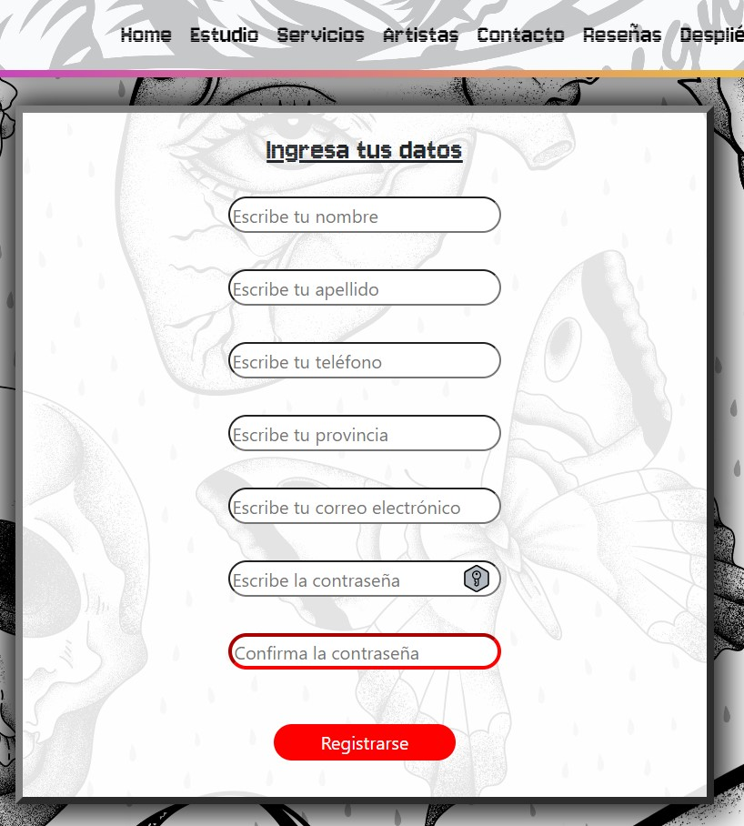
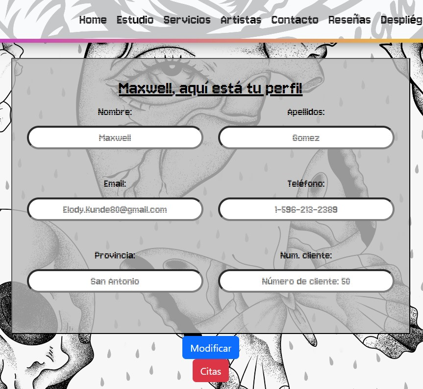
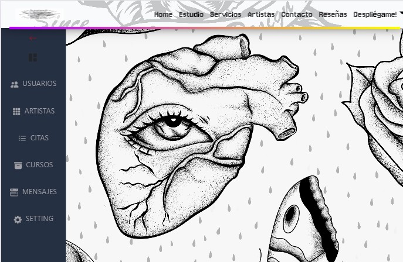
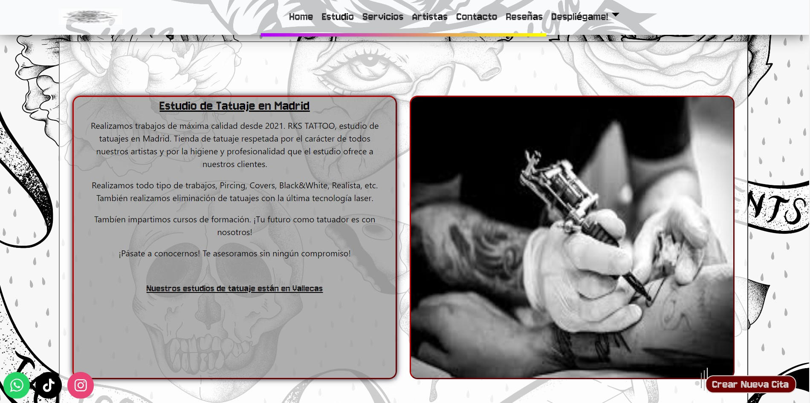
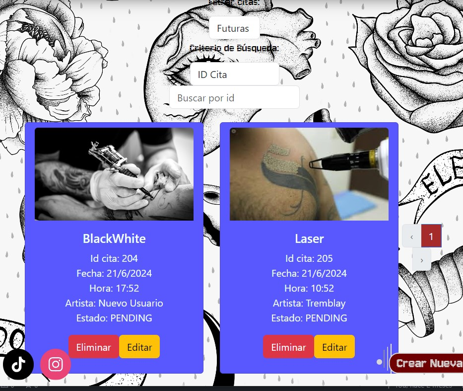

[](https://github.com/Akshay090/svg-banners)

<H4 align="center">✒ESTUDIO DE TATUAJE✒</H4> 

<H6>Proyecto 5 del Bootcamp Full Stack Developer de Geekshubs Academy</H6>

## 🚀 Descripción

Recrea la parte frontend de un estudio de tatuajes, con gestión de usuarios y citas. En la aplicación los usuarios pueden registrarse, iniciar sesión, acceder a su perfil personal, crear, editar y eliminar citas. Como perfil de artista se puede ver las citas que tiene agendadas y con qué cliente. También hay un panel de administrador, en el cual se tiene la capacidad de crear, editar y borrar usuarios o citas.

## 🛠️ Tecnologías Utilizadas

[]()
[]()
[]()
[]()
[]()

## 🎯 Funcionalidades

- **Registro de usuarios**: Permite a los nuevos usuarios crear una cuenta.
- **Login**: Los usuarios pueden iniciar sesión en su cuenta.
- **Área de cliente**: Acceso a un panel de usuario donde pueden gestionar sus citas.
- **Gestión de citas**: Los clientes pueden programar, modificar y cancelar citas con tatuadores.
- **Funcionalidades de administrador**:
  - **Gestión de usuarios**: Permite ver, editar y eliminar usuarios.
  - **Gestión de citas**: Permite ver y modificar citas programadas.

## ⚙️ Instrucciones de uso

1. **Clonar el repositorio**:
   ```jsx
   git clone https://github.com/Kurtko10/estudio-tatuaje-front
    ```
2. **Instalar dependencias**: 
    ```bash
    cd nombre_de_la_carpeta

    npm i
    
    ```
### Backend

    https://github.com/Kurtko10/estudio-tatuaje


### Acceso a la aplicación:

- Usuarios: Registrarse y luego iniciar sesión para acceder a su área de cliente.
- Administradores: Iniciar sesión con credenciales de administrador para acceder a las funcionalidades administrativas.

### Capturas de pantalla de la aplicación:
- Login
📸 
- Registro
📸 
- Perfil de usuario
📸 
- Panel de Administrador
📸 
- Home
📸 
- Gestión de Citas
📸 

🌟 Mejoras

- Implementar avisos de errores.
- Incluir una foto de usuario.
- Formulario de contacto.
- Sistema de reseñas y valoraciones.
- Mejora de la interfaz de usuario.

📧 Contribuciones
¡Las contribuciones son bienvenidas!

